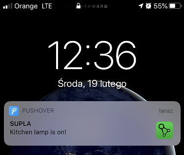

# SUPLA-PUSHOVER


This software is a fork from [`supla-core`](https://github.com/SUPLA/supla-core) used to send notifications from SUPLA to your android or ios device via [`Pushover`](https://pushover.net/) service. This is not official SUPLA software. There are plans to have native notification support in SUPLA in near future. 

<b>Your are using this software for your own risk. Please don't rely on it if it comes to a life danger situation.</b>

In order to use this software you need to have Pushover account, SUPLA account and a device like Raspberry Pi (3,4,Zero) or computer with linux installed (like Ubuntu). You need to install a Pushover mobile app on your device too.

The possibilities of this solution are described below. 

<p align="center"> 

</p>


# Installation
```
sudo apt-get update
sudo apt-get install -y git libssl-dev build-essential curl bc
git clone https://github.com/lukbek/supla-pushover.git
cd supla-pushover
./install.sh
```

### Upgrade

Stop `supla-pushover` and execute:

```
cd supla-pushover
./install.sh
```

### Configuration

After installing there should be a supla-pushover-config.yaml file generated for you. You need to adjust your SUPLA account data, Pushover account data and configure conditions for notifications. 
Remember that you need to enable SUPLA client device registration (smartphone) before starting this software and after starting it you need to assign an access id to the 'Supla pushover' client device witch appeared in SUPLA cloud.
The Pushover user key (not e-mail address) of your user (or you), viewable when logged into Pushover dashboard, token is your application's API token viewable when clicked on your Pushover application.

```
supla:
  port: 2016
  host: 'srvX.supla.org'
  email: 'email@supla.org'
  protocol_version: 10

pushover:
  user: 'XXXXXXXX'
  token: 'XXXXXXX'
  device: 'my_device'

notifications:
  - trigger: 'onchange'
    condition: '%channel_1% == 1 || %channel_4% == 1'
    message: 'kitchen lamp is on!'

  - trigger: 'ontime'
    time: '0 0 22 * * *'
    condition: '%channel_2% == 1 && %channel_3% == 1'
    message: 'porch lights are on!'
    device: 'my_device_1'
  
  - trigger: 'onchange'
    condition: '%channel_12% > 23.4'
    message: 'it is hot!'
    reset: 'none'
    
  - trigger: 'onchange'
    condition: '%channel_543% > 24.0'
    message: 'it is really hot'
    debounce: 3000
    
  - trigger: 'onconnection'
    condition: '%channel_12% == 0'
    message: 'Outside thermometr went offline!'
    priority: 2
    priority_expire: 300
    priority_retry: 30

  - trigger: 'onconnection'
    condition: '%channel_12% == 1'
    message: 'Outside thermometr is online!'
    
  - trigger: 'onconnection'
    condtition: '%channel_12% == 1 || %channel_12% == 0'
    message: 'Outside thermometr changed its connection state'

```

By default, the notification will only be sent the first time the condition is checked (if it is met). For example, for the temperature condition% channel_12% <15, it is met if the temperature value of channel 12 falls below 15 degrees - a notification will be sent. However, it will not be sent again until the temperature rises above 15 degrees and falls below it again. If you set the reset mode parameter to none, notifications will be sent each time the condition is checked, if the temperature is still below 15 degrees.

You can specify the device to send notifications to. If you specify it in the Pushover settings section, all notifications will be sent to this device, but you can specify this setting for a specific notification. If a device is not specified, a notification is sent to all registered devices. The device is registered in the Pushover dashboard.

Let's focus on the terms of notifications. There are three types of triggers `onchange`, `ontime` and `onconnection`. The first occurs when one of the conditioned channels changes, the second triggers when the time condition is set. Third is firing when connection state of channel has changed, you can get notification both on go offline/online state.
For a time trigger, both the time expression and the condition must be true to trigger the notification.

You can specify `title` on `pushover` level or on `notification` level. If you do so, the notification will be send with that title.
The default is 'SUPLA' when not provided.

Now you can set the priority of notification using `priority`, `priority_expire`, `priority_retry` parameters. Read more at [`Pushover Priority`](https://pushover.net/api#priority)

Now you can set `debouce` parameter in milliseconds. Debounce parameter means that condition will be true if changes between previous notification and current notification are longer than this parameter.


# Condition language

In `condition` property you set an condition that must be set to trigger notification.
When you use %channel_N% (N is an channel id viewable in SUPLA cloud), parser will replace it with current channel value.
It'is using [`bc tool`](https://pl.wikipedia.org/wiki/Bc_(Unix)) for parsing expressions.

Example: 

Let's channel_1 is an temperature sensor. if you define condition like `%channel_1% > 15` parser will replace `%channel_1%` with value of current temperature and check if condition is set. If is it will trigger an notification.

Moreover conditions can be more sofisticated:

Assume that channel_2, channel_3, channel_4 are lamps. 
Condition `(%channel_2% == 1 || %channel_3 == 1) && %channel_4% == 0` will be true if `%channel_2%` or `%channel_3%` value is `1` and `%channel_4%` value is `0`.

You can test your condition with `bc` application that should be installed in your device. 
if you write `echo "(1 == 1 || 0 == 1) && 1 == 0" | bc` (channel values are example set of them) it will return a 1 if condition is set and 0 if it's not. Otherwise it will report and syntax error means that condition is wrong. In above example it will return 0 because 0 == 1 expression is false.

# Time condition format 

If you want use `ontime` trigger type you need to set `time` property. It is in [`cron`](https://en.wikipedia.org/wiki/Cron) format but with seconds support. Seconds are in first position of six character set.

Examples:

* `time='* * * * * *'` will trigger every second
* `time='*/5 * * * * *'` will trigger on every 5 second
* `time='0 5 * * * *'` will trigger on every fifth minute of every hour
* `time='0 0 22 * * *'` will trigger every day at 22:00 hour

You can test your value executing `supla-pushover` with `-ct` parameter. 
`./supla-pushover -ct "0 0 22 * * *"` will print on screen next 20 executions of provided expression.

# SUPLA channel support

This software for one supports only all kind of sensors and relays. It is not supporting electricity meters for now. But I will add them in near future.

Some sensors are connected to the other device or having more than one value in. In order to use them you need use `field index` in `%channel_I_N%` template.

Sensors witch are connected to the device (for example gate_sensor is connected to gate device) are sending their values with main device so you can get the value by index. 

Suppose you have gate device with id 32 and connected to it opening_sensor 33 and opening_sensor 34 (as full part open sensor)

If you want get sensor values you can write condition like:
* `%channel_0_32%` or `%channel_32%` gets relay value of gate device
* `%channel_1_32%` gets value of first connected sensor 
* `%channel_2_32%` gets value of second connected sensor 

Humidity and temperature sensors has two values (temp and humidity). 
Temperature value is on 0 index, humidity is 1 so if you want to use humidity condition you need to define like `%channel_1_12` where `12` is an channel id and `1` is an humidity value field index (0 - temp, 1 - humidity).

* `%channel_12%` or `%channel_0_12%` gets temp value
* `%channel_1_12` gets humidity value

# Support

Feel free to ask on [`SUPLA's forum`](https://forum.supla.org/viewtopic.php?f=9&t=6188) for this software and report issues on github.

